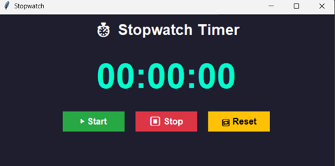
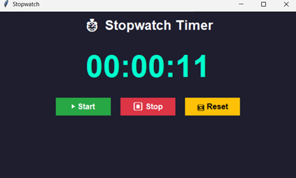

# ⏱️ Neon Stopwatch Timer – Python Tkinter GUI

A sleek and modern **Stopwatch Timer App** built using Python's `tkinter` library. Featuring a neon-themed UI, stylish buttons, and smooth functionality for starting, stopping, and resetting your time – perfect for productivity, workouts, or coding sessions!



---

## 🚀 Features

✅ Minimalistic & Stylish GUI
✅ Neon color scheme with dark mode vibes
✅ Real-time stopwatch with hour\:minute\:second format
✅ Three main controls – Start ▶, Stop ⏸, and Reset 🔁
✅ Lightweight & easy to run – No extra dependencies!

---

## 🛠️ Technologies Used

* **Python 3.x**
* **Tkinter** – Python's standard GUI library

---

## 🖼️ Screenshots

> Add your actual screenshot paths or upload images to GitHub and link here

| Start                                    | Stop                                   | Reset                                    |
| ---------------------------------------- | -------------------------------------- | ---------------------------------------- |
|  |  |  |

---

## 📦 How to Run

1. **Clone this repository:**

   ```bash
   git clone https://github.com/your-username/tkinter-stopwatch.git
   cd tkinter-stopwatch
   ```

2. **Run the Python file:**

   ```bash
   python stopwatch.py
   ```

> Make sure Python is installed on your system. This app doesn't require any external libraries.

---

## 🧠 Code Overview

```python
# Core stopwatch logic
def update_stopwatch():
    global counter
    if running:
        minutes, seconds = divmod(counter, 60)
        hours, minutes = divmod(minutes, 60)
        label.config(text=f"{hours:02d}:{minutes:02d}:{seconds:02d}")
        counter += 1
        root.after(1000, update_stopwatch)
```

The timer updates every 1 second (`1000ms`) using `root.after`, and displays formatted time in `HH:MM:SS`.

---

## 🎨 UI Inspiration

* Neon cyan on dark background for that futuristic feel
* Bootstrap-like button colors for intuitive use:

  * ✅ Green Start
  * 🔴 Red Stop
  * 🔁 Yellow Reset

---

## 📸 Want to Show It Off?

You can upload your screenshots to a service like [Imgur](https://imgur.com/) or directly in your GitHub repo’s `images/` folder and update the paths in the README.

---

## 🧑‍💻 Author

**\[Vinayak Vathare]** – [GitHub Profile](https://github.com/VathareVinayak)
Feel free to ⭐ the repo or suggest improvements!

---

Would you like me to help you embed your screenshots directly into this `README.md` using actual image links?
